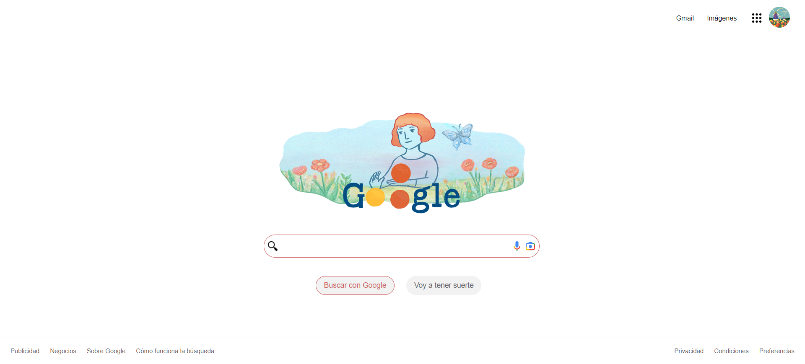

# google-clone

**Clonación de la Interfaz de Google con HTML y CSS*

Hola, el proyecto fue creado durante el curso de Tecnolochicas Pro, llevando en práctica lo aprendido realizando la interfaz pricipal de navegador de GOOGLE:💻
****

Para ello se puso en practica lo visto en los cursos para lograr realizar un clon de explorador de google.

## 1. Demo
Puedes entrar a ver el demo en este vínculo: 

https://dazzling-nightingale-01ce86.netlify.app
****

## 2. Contenido del proyecto

`Header`

Muestra un menú, foto de perfil de la cuenta, iconos y logo de google.

`main`

Contiene los elementros centrales del buscador.

`footer`

Incluye hipervinculos al final de la pagina.
****

## 3. Vista previa del proyecto

**Hecho por:**
- Jazmín Gutiérrez ❤

